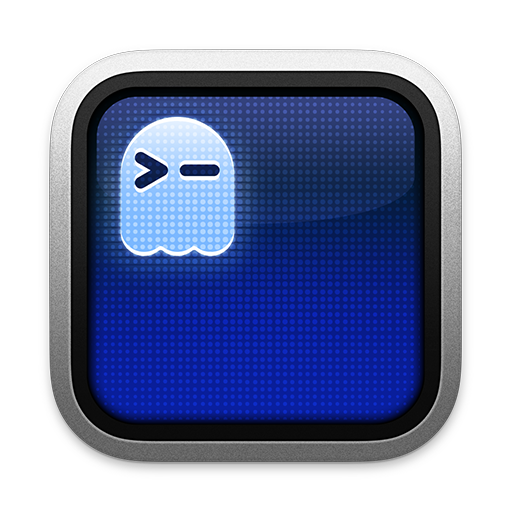
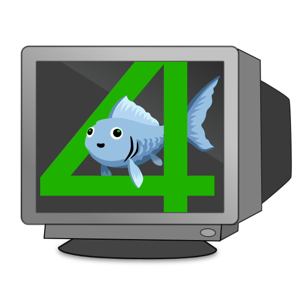

# 🐻‍❄️ Polar Bear

One-script terminal environment setup for **macOS**, **Debian/Ubuntu**, and **Windows (WSL)**. Run on a fresh machine, get a fully configured terminal in minutes.

**🇨🇳 [中文版文档](README_CN.md)**

<p align="center">
  
  &nbsp;&nbsp;
  
  &nbsp;&nbsp;
  
  &nbsp;&nbsp;
  
</p>

<p align="center">
  
</p>

## Supported Platforms

| Platform | Status | Package Manager |
|----------|--------|----------------|
| 🍎 **macOS** | ✅ Primary — battle-tested | Homebrew |
| 🐧 **Debian / Ubuntu** | 🧪 Experimental — works but not extensively tested | apt + bundled binaries |
| 🪟 **Windows (WSL)** | 🧪 Experimental — works but not extensively tested | apt (inside WSL) |
| 🪟 **Windows (native)** | ⛔ Not supported | Use WSL instead |

## Quick Start

### macOS

```bash
git clone https://github.com/webxiongda/xiong-terminal-setup.git
cd xiong-terminal-setup && ./setup.sh
```

### Debian / Ubuntu

```bash
git clone https://github.com/webxiongda/xiong-terminal-setup.git
cd xiong-terminal-setup && ./setup.sh
```

### Windows (WSL)

First install WSL if you haven't:
```powershell
# In PowerShell (Admin)
wsl --install
```

Then inside WSL:
```bash
git clone https://github.com/webxiongda/xiong-terminal-setup.git
cd xiong-terminal-setup && ./setup.sh
```

### Options

```bash
./setup.sh --fish        # Fish shell
./setup.sh --zsh         # Zsh + fish-like plugins
./setup.sh --skip-node   # Skip fnm + Node.js installation
./setup.sh --dry-run     # Preview what would be done (no changes)
./setup.sh --reinstall   # Force reinstall all tools
```

One-liner (auto-clones):

```bash
bash <(curl -fsSL https://raw.githubusercontent.com/webxiongda/xiong-terminal-setup/main/setup.sh)
```

## Choose Your Shell

| | 🐟 Fish | 🐚 Zsh |
|---|---------|---------|
| **POSIX** | ❌ Own syntax | ✅ Compatible |
| **Autosuggestions** | ✅ Built-in | ✅ via plugin |
| **Syntax Highlighting** | ✅ Built-in | ✅ via plugin |
| **Abbreviations** | ✅ Auto-configured | ❌ Use aliases |
| **Node Manager** | fnm (shared) | fnm (shared) |
| **Config** | `~/.config/fish/config.fish` | `~/.zshrc` |
| **History Search** | Built-in | ↑/↓ prefix search |
| **Best for** | Clean defaults, no fuss | Scripting, POSIX compat |

## Stack

| Component | What |
|-----------|------|
| **[Ghostty](https://ghostty.org)** | GPU-accelerated terminal emulator |
| **Fish** or **Zsh** | Shell (your choice) |
| **[Starship](https://starship.rs)** | Cross-shell prompt (Catppuccin Mocha theme) |
| **MesloLGS NF** | Nerd Font for icons & powerline glyphs |
| **[bat](https://github.com/sharkdp/bat)** | `cat` with syntax highlighting & line numbers |
| **[eza](https://github.com/eza-community/eza)** | `ls` with icons, git status, tree view |
| **[fd](https://github.com/sharkdp/fd)** | `find` but fast & intuitive |
| **[ripgrep](https://github.com/BurntSushi/ripgrep)** | `grep` but orders of magnitude faster |
| **[fzf](https://github.com/junegunn/fzf)** | Fuzzy finder (Ctrl+R / Ctrl+T / Alt+C) |
| **[btop](https://github.com/aristocratos/btop)** | Beautiful system monitor |
| **[zoxide](https://github.com/ajeetdsouza/zoxide)** | Smart `cd` that learns your habits |
| **[jq](https://github.com/jqlang/jq)** | JSON processor |
| **[tldr](https://github.com/tldr-pages/tldr)** | Simplified man pages with examples |
| **[delta](https://github.com/dandavison/delta)** | Beautiful git diffs with syntax highlighting |
| **[lazygit](https://github.com/jesseduffield/lazygit)** | Git TUI |
| **[fnm](https://github.com/Schniz/fnm)** | Fast Node Manager (Rust) |
| **[Zellij](https://zellij.dev)** | Modern terminal multiplexer (optional) |

## What It Does

1. Installs **package manager** (Homebrew on macOS, apt on Linux)
2. Installs **Ghostty** terminal (macOS; Linux users install separately)
3. Downloads **MesloLGS NF** nerd fonts (bundled in repo, no download needed)
4. Installs your **shell** of choice + plugins
5. Installs all **CLI tools** (Homebrew on macOS, apt + bundled binaries on Linux)
6. Installs **Starship** prompt with Catppuccin Mocha config
7. Installs **fnm** + **Node.js** LTS (optional, skips if fnm already installed)
8. Installs **Zellij** terminal multiplexer (optional)
9. Deploys all config files (existing configs are backed up with timestamps)
   - Configures **git-delta** as git pager with syntax highlighting
   - Sets up **fish abbreviations** or **zsh aliases** automatically
   - Initializes **zoxide** and **fzf** in shell config
   - Includes **SSH key switcher** function

## Platform Notes

### macOS
- Full support, everything installs via Homebrew
- Ghostty installs as a native macOS app
- Fish abbreviations are automatically configured
- All fonts and configs deploy seamlessly

### Debian / Ubuntu
- CLI tools install via apt where available, bundled binaries for others (delta, lazygit, eza, tldr)
- `bat` → `batcat`, `fd` → `fdfind` — symlinks are created automatically
- Fonts install from bundled files in `fonts/` directory to `~/.local/share/fonts/`
- Ghostty is not in apt — install manually via [snap, build from source](https://ghostty.org/docs/install), or use another terminal
- Zsh plugins install via apt or git clone fallback
- Shell configs are automatically patched for Linux paths (no Homebrew references)
- fnm installs to `~/.local/share/fnm` on Linux

### Windows (WSL)
- Everything runs inside WSL (Ubuntu/Debian layer)
- Terminal emulator runs on the Windows side — use [Windows Terminal](https://aka.ms/terminal) or [Ghostty for Windows](https://ghostty.org)
- Ghostty config deploys to `~/.config/ghostty/` in WSL for reference (actual config on Windows side)
- Script detects WSL automatically and adapts
- If run in native Windows (MINGW/Git Bash), the script will prompt you to install WSL

## Aliases / Abbreviations

| Shortcut | Expands To |
|----------|-----------|
| `ls` | `eza --icons --group-directories-first` |
| `ll` | `eza -la --icons --group-directories-first` |
| `lt` | `eza --tree --icons --level=2` |
| `cat` | `bat` |
| `find` | `fd` |
| `grep` | `rg` |
| `top` | `btop` |
| `lg` | `lazygit` |
| `cd` (Fish only) | `z` (zoxide) |

## fzf Keybindings

| Key | What |
|-----|------|
| `Ctrl+R` | Fuzzy search command history |
| `Ctrl+T` | Fuzzy find files (uses `fd` as backend) |
| `Alt+C` | Fuzzy cd into directory |

## fnm — Node Version Manager

```bash
fnm install 22            # Install Node 22
fnm install --lts         # Install latest LTS
fnm default 22            # Set default version
fnm use 22                # Switch in current shell
echo "22" > .node-version # Auto-switch when entering this directory
```

## SSH Key Switcher

Both shell configs include a `set-ssh-key` function for quick SSH key switching:

```bash
set-ssh-key my-key-name     # Clears agent, loads ~/.ssh/my-key-name
set-ssh-key                  # Shows available keys on error
```

---

## License

MIT
